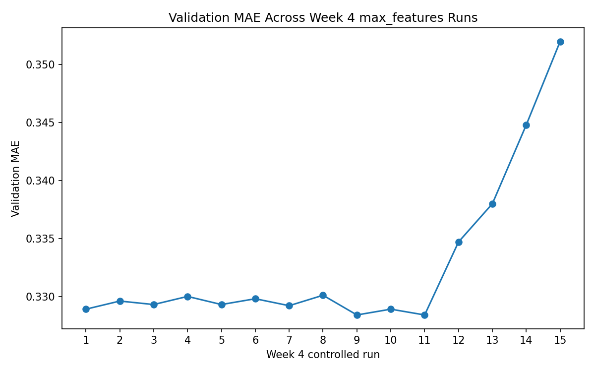

# Week 4 Controlled Experiment 

## Goal

Test whether changing the `max_features` hyperparameter in `RandomForestRegressor` affects validation MAE.

## Experiment Axis

The main experiment axis is `max_features`. The controlled follow-up runs also vary `n_estimators` and `min_samples_leaf`.

## Held Fixed

- Model family: RandomForestRegressor
- n_estimators: 300 for the main max_features sweep; 400 and 1000 for the follow-up runs
- min_samples_leaf: 1 for the max_features and tree-count sweeps; varied in the leaf-size sweep
- random_state: 390
- n_jobs: -1
- Preprocessing: unchanged
- Data split: unchanged
- Metric: validation MAE
- Evaluator: run.py
- Editable file: model.py only

## Success/Decision Rule

- keep: valid MAE lower than previous best
- discard: valid MAE greater than or equal to previous best
- crash: no valid MAE produced

# Week 4 Experiment-Result Matrix

| Run | Condition | n_estimators | max_features | min_samples_leaf | Val MAE | Runtime sec | Status | Decision | Interpretation |
|---|---|---:|---:|---:|---:|---:|---|---|---|
| A | Lower feature subsampling | 300 | 0.5 | 1 | 0.3294 | 72.1585 | success | discard | max_features=0.5 worsened MAE, suggesting too much feature subsampling may reduce split quality. |
| B | Current/baseline setting | 300 | 0.7 | 1 | 0.3289 | 116.7758 | success | discard | max_features=0.7 was the strongest controlled 300-tree setting, suggesting moderate feature subsampling works best in this set. |
| C | Full feature availability | 300 | 1.0 | 1 | 0.3296 | 120.5494 | success | discard | max_features=1.0 was similar to 0.7 but worse, suggesting the model is not very sensitive to this parameter in the tested range. |
| D | Higher feature subsampling | 300 | 0.85 | 1 | 0.3293 | 144.2035 | success | discard | max_features=0.85 landed between 0.7 and 1.0, suggesting extra feature availability did not improve the 300-tree forest. |
| E | Intermediate feature subsampling | 300 | 0.72 | 1 | 0.33 | 114.0266 | success | discard | max_features=0.72 was worse than 0.7, suggesting small moves above the baseline do not reliably improve MAE. |
| F | Intermediate feature subsampling | 300 | 0.75 | 1 | 0.3293 | 94.0711 | success | discard | max_features=0.75 matched the 0.85 result, suggesting midrange values are stable but not competitive with the best overall model. |
| G | Intermediate feature subsampling | 300 | 0.78 | 1 | 0.3298 | 109.8493 | success | discard | max_features=0.78 was one of the weaker controlled runs, suggesting this setting may add noise without improving splits. |
| H | Intermediate feature subsampling | 300 | 0.82 | 1 | 0.3292 | 85.5758 | success | discard | max_features=0.82 was the best of the added midrange probes, but still did not beat the 0.7 controlled baseline. |
| I | Follow-up tree count probe | 400 | 0.72 | 1 | 0.3301 | 6814.4588 | success | discard | Increasing to 400 trees at max_features=0.72 worsened MAE, suggesting more trees did not rescue this feature-sampling setting. |
| J | Follow-up best-setting repeat | 400 | 0.7 | 1 | 0.3284 | 91.4724 | success | discard | Returning to max_features=0.7 with 400 trees matched the best MAE but did not improve it, suggesting the earlier best is stable but hard to beat. |
| K | Large tree count probe | 1000 | 0.7 | 1 | 0.3289 | 259.9565 | success | discard | Increasing to 1000 trees at max_features=0.7 worsened MAE versus the 400-tree run, suggesting additional trees add cost without improving validation error. |
| L | Leaf-size baseline repeat | 400 | 0.7 | 1 | 0.3284 | 77.0444 | success | discard | min_samples_leaf=1 again matched the best MAE, confirming the current low-leaf setting is the strongest tested option. |
| M | Mild leaf regularization | 400 | 0.7 | 5 | 0.3347 | 39.0335 | success | discard | min_samples_leaf=5 worsened MAE, suggesting even mild leaf regularization underfits this dataset. |
| N | Moderate leaf regularization | 400 | 0.7 | 10 | 0.338 | 32.1123 | success | discard | min_samples_leaf=10 further worsened MAE, reinforcing that larger leaves reduce useful tree detail. |
| O | Strong leaf regularization | 400 | 0.7 | 25 | 0.3448 | 19.5721 | success | discard | min_samples_leaf=25 traded speed for substantially worse MAE, suggesting the forest needs smaller terminal nodes. |
| P | Very strong leaf regularization | 400 | 0.7 | 50 | 0.352 | 15.5692 | success | discard | min_samples_leaf=50 was the weakest leaf sweep result, indicating heavy smoothing discards too much signal. |

# Week 4 Metric-Over-Time Plot

