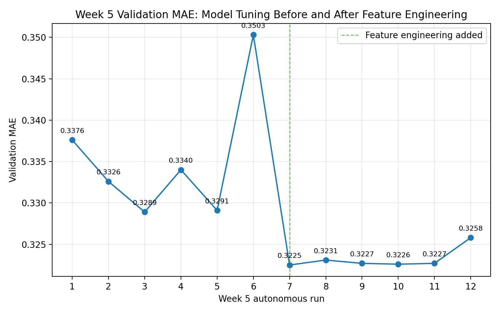

# Week 5 Autonomous Block Log

## Starting Point Before Autonomous Block

**Starting baseline model:** Linear regression  
**Baseline validation MAE:** `0.3825`

**Current best model before Week 5 block:**  
`Random Forest n_estimators = 400 max_features = 0.7`

**Current best validation MAE before Week 5 block:**  
`0.3284`

**Results**
All 6 Week 5 runs were successful but discarded.
Keep = 0
Discard = 6
Crash = 0
Dominant failure type = signal failure

| Run | Description | Validation MAE | Decision |
|---|---|---:|---|
| 1 | Random Forest, `max_depth=20` | 0.3376 | Discard |
| 2 | Random Forest, `max_depth=30` | 0.3326 | Discard |
| 3 | Random Forest, `n_estimators=300`, `max_features=0.7` | 0.3289 | Discard |
| 4 | Extra Trees, `n_estimators=400`, `max_features=0.7` | 0.3340 | Discard |
| 5 | Random Forest, `max_samples=0.8` | 0.3291 | Discard |
| 6 | Gradient Boosting, `n_estimators=200`, `learning_rate=0.05`, `max_depth=3`, `subsample=0.8` | 0.3503 | Discard |

## Post-Feature-Engineering Model-Tuning Block

This second Week 5 block was run **after** the feature-engineering update that added `brand_name` as a categorical feature and froze the engineered feature setup. The feature-engineering logic, preprocessing, target, validation split, metric, and final test set remained unchanged. Only `model.py` was modified during the experiments, and `results.tsv` was updated only by running `run.py`.

**Starting best after feature engineering:**  
`Random Forest n_estimators = 400 max_features = 0.7`

**Starting validation MAE after feature engineering:**  
`0.3225`

**Results**
All 5 post-feature-engineering model-tuning runs were successful but discarded.
Keep = 0
Discard = 5
Crash = 0
Dominant failure type = no model-only change improved on the engineered-feature best

| Run | Description | Validation MAE | Runtime Seconds | Decision |
|---|---|---:|---:|---|
| 1 | Random Forest, `n_estimators=400`, `max_features=0.6` | 0.3231 | 89.3135 | Discard |
| 2 | Random Forest, `n_estimators=400`, `max_features=0.75` | 0.3227 | 97.2136 | Discard |
| 3 | Random Forest, `n_estimators=600`, `max_features=0.7` | 0.3226 | 132.0807 | Discard |
| 4 | Random Forest, `n_estimators=400`, `max_features=0.7`, `min_samples_split=4` | 0.3227 | 94.7354 | Discard |
| 5 | Extra Trees, `n_estimators=500`, `max_features=0.75` | 0.3258 | 160.8591 | Discard |

**Best post-feature-engineering tuning result:**  
`0.3226`, from Random Forest with `n_estimators=600` and `max_features=0.7`.

**Conclusion:**  
The post-feature-engineering model-tuning block did not improve on the `0.3225` feature-engineered best. The closest run was only `0.0001` MAE worse, suggesting the current Random Forest setup remains a strong local optimum on the fixed engineered feature set.

# Week 5 Metric Trajectory Plot

